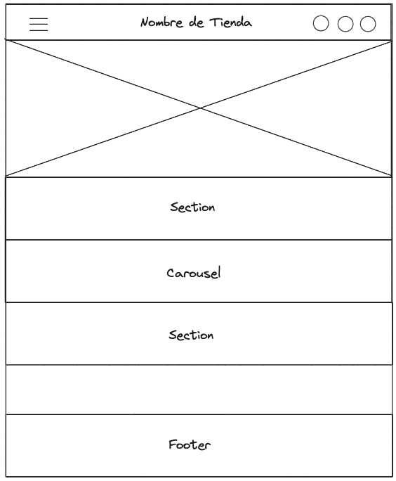
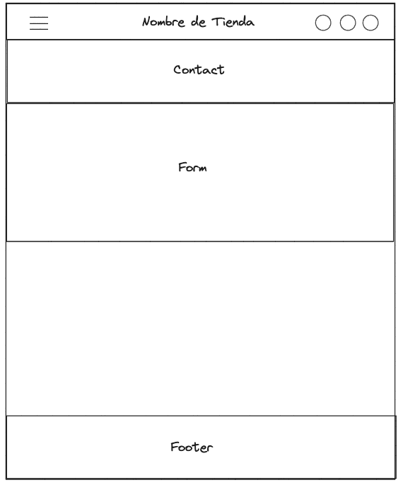

# Sistema Ecomerce React + Vite

Esta tienda web es una plataforma de comercio electrónico desarrollada con la tecnología MERN (MongoDB, Express.js, React.js y Node.js) y se encuentra alojada en Render.com. Proporciona una experiencia de compra en línea tanto para clientes como para administradores.

## Características Principales

### Para Clientes

- **Exploración de Productos:** Los clientes pueden explorar una amplia gama de productos.

- **Registro y Autenticación:** Los usuarios pueden registrarse en la plataforma y luego iniciar sesión para acceder a funcionalidades adicionales y realizar compras.

- **Carrito de Compras:** Los clientes pueden agregar productos a su carrito de compras y proceder al proceso de pago de forma segura.

- **Perfil de Usuario:** Los usuarios pueden administrar su información personal, ver su historial de compras y ajustar su configuración.

### Para Administradores

- **Gestión de Productos:** Los administradores pueden crear, editar y eliminar productos. Esto incluye agregar categorías y variantes para organizar los productos de manera eficiente.

- **Gestión de Categorías:** Los administradores pueden crear y administrar categorías para organizar los productos en la tienda.

- **Gestión de Usuarios:** Los administradores pueden crear cuentas de usuario para otros administradores, modificar perfiles de usuario y gestionar los roles y permisos de acceso.

- **Seguimiento de Clientes:** Se puede acceder a la información de los clientes, lo que permite una comprensión más profunda de las preferencias y el historial de compras.

## Configuración y Uso

1. **Clonar el Repositorio:** Clona este repositorio en tu entorno de desarrollo local.

2. **Instalar Dependencias:** Utiliza `npm install` en el directorio raíz para instalar todas las dependencias tanto para el servidor como para el cliente.

3. **Configuración de Variables de Entorno:** Asegúrate de configurar las variables de entorno necesarias, como las credenciales de MongoDB y las claves de autenticación.

4. **Ejecución del Servidor:** Utiliza `npm run dev` para iniciar el servidor en un entorno de desarrollo.

5. **Ejecución del Cliente:** Navega al directorio del cliente y utiliza `npm start` para iniciar la aplicación de cliente.

6. **Acceso de Administrador:** Utiliza las credenciales de administrador para acceder a las funciones administrativas.

## Tecnologías Utilizadas

- MongoDB para la base de datos.
- Express.js para la creación de API RESTful.
- React.js (VITE) para la interfaz de usuario del cliente.
- Node.js para la lógica del servidor.
- Render.com para el alojamiento en la web.

### Wireframe

### Dependencias utilizadas

- "axios": "^1.4.0",
- "bootstrap-icons": "^1.10.5",
- "jwt-decode": "^3.1.2",
- "react-bootstrap": "^2.8.0",
- "react-dom": "^18.2.0",
- "react-router-dom": "^6.14.2"

## Licencia

Este proyecto está bajo la Licencia MIT.

---
